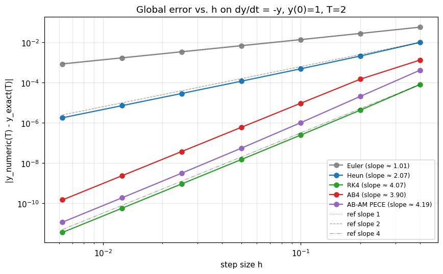
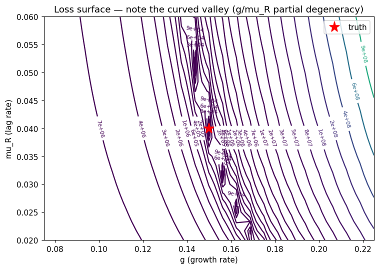

# Startup Growth Simulator

> **Live at [startup-growth.vercel.app](https://startup-growth.vercel.app/)** — the editorial landing page with the methodology, the calibration valley, the μ\* slider, and a real-data anchor calibrated against Shopify Inc.'s pre-IPO S-1 quarterly revenue.
>
> **Interactive tool at [startup-growth-simulator.streamlit.app](https://startup-growth-simulator.streamlit.app/)** — plug in your own startup's parameters across all 8 model dimensions and watch the engine compute the trajectory, sensitivity, and runway-survival threshold μ\* live.

**In one sentence:** I built a tool that finds the exact monthly user-cancellation
rate above which a typical SaaS startup runs out of money before it can ever
recover, and put a confidence interval around the answer using only numerical
methods I implemented from scratch.

For the default-SaaS profile that rate is **about 14% per month**, with
calibration uncertainty putting the 95% confidence range at **8%–16%**.
Above 14% monthly user churn, the business ends a 10-year horizon cash-negative;
below, it survives. We call this μ\* — the *runway-survival threshold at T = 120*.

This is the final project for **CSC 30100 (Numerical Analysis), City College of
New York, Spring 2026**. Every numerical method here — five ODE solvers,
gradient descent, Adam, Newton/bisection/secant, finite differences, Richardson
extrapolation, the Thomas algorithm, cubic splines, composite Simpson, Gaussian
quadrature, Monte Carlo with Kahan summation — was implemented from scratch.
**No SciPy.**

The driving question:
> At what user-churn rate does a startup's growth become *mathematically
> irreversible* — and how confident can we be in that answer?

(For precision: μ\* is the runway-survival threshold at the 10-year horizon
we evaluate, not the abstract phase-portrait separatrix. The two coincide
for the regimes we tested.)

## The two findings I'm proudest of

**1. The headline answer with a real confidence interval.** μ\* ≈ 14.2% per month,
95% CI [8.0%, 16.0%], obtained by sampling the calibrated parameters from
their posterior, solving the ODE for each sample, and bisecting on the
terminal-cash sign change. On a representative break-even instance Newton
converges in 4 iterations, secant in 7, bisection in 18 — the textbook
ordering of quadratic > super-linear > linear convergence.

**2. A structural-identifiability finding.** When I fit the model to noisy
revenue data, two of its parameters — growth rate $g$ and the billing-cycle
lag $\mu_R$ — can't be separately identified from a finite observation
window. The fit produces a curved valley in parameter space, not a single
best-fit point. I then asked the harder question: does that ambiguity
matter for the answer? Walking the valley via the smallest-eigenvalue
eigenvector of the calibration loss Hessian, μ\* varies by ~2.4%.
**Even though the calibration is ambiguous, the answer it produces is
robust to that ambiguity.** Documented in
[Notebook 5](notebooks/05_sensitivity_analysis.ipynb).

**Real-data anchor:** the engine's Adam optimizer was also fit against
Shopify Inc.'s pre-IPO S-1 quarterly revenue (9 quarters, 2012-Q4 through
2014-Q4, public SEC EDGAR data). Recovered growth rate `g = 13.5%/month`,
converged in 242 iterations. The fitted RK4 trajectory tracks the
late-quarter trend (the early quarters underfit by ~1M USD, consistent
with a 1-parameter fit on a more nuanced acquisition phase). Visible on
the live landing page; the calibration script is
[`scripts/precompute_landing_data.py`](scripts/precompute_landing_data.py).

> ⚠ **One caveat in the headline number:** the 95% CI above propagates
> uncertainty in $(g, \mu_R)$ only — the conversion rate $\alpha$ is
> held at its calibrated MAP. Because $\alpha$ has the largest sensitivity
> ($\partial\mu^*/\partial\alpha \approx 3.04$, vs. 1.18 for $\mu_R$ and 0.51
> for $g$), the marginal CI under joint uncertainty is wider than the
> conditional CI reported. A full joint posterior is deferred work.




## Two surfaces, two audiences

The project ships two distinct surfaces backed by the same Python engine:

| Surface | URL | Audience | Optimized for |
|---|---|---|---|
| **Editorial landing** | [startup-growth.vercel.app](https://startup-growth.vercel.app/) | LinkedIn skim, recruiter, professor reading the writeup | 30-second skim, narrative arc, structural-identifiability finding, Shopify-calibrated real-data anchor |
| **Interactive tool** | [startup-growth-simulator.streamlit.app](https://startup-growth-simulator.streamlit.app/) | A founder who wants to plug in their own company's numbers | 5–10 minutes of exploration, all 8 model parameters editable, live recompute |

Both surfaces import from the same `engine/*` package — every solver,
optimizer, root-finder, integrator, and Monte Carlo loop on either page
lives in `engine/` and is covered by the test suite.

## Status (all phases shipped)

- **Phase 1 (shipped):** 4D ODE system, Euler / Heun / RK4, error metrics,
  synthetic data generator, Notebook 1.
- **Phase 2 (shipped):** Adams-Bashforth-4, Adams-Moulton predictor-corrector,
  numerical differentiation (forward / central / 5-point / Richardson),
  gradient descent and Adam optimizers, Newton/bisection/secant root-finders,
  MSE loss + closure-factory loss builder. Notebooks 2 & 3.
- **Phase 3 (shipped):** composite Simpson + Gauss-Legendre quadrature,
  Thomas algorithm + natural & clamped cubic splines, Monte Carlo (Kahan
  summation, antithetic variates, convergence study). Notebooks 4 through 7.
  Streamlit interactive tool with all 8-parameter sliders.
- **Phase 4 (shipped):** Editorial Next.js + Tailwind landing page deployed
  to Vercel. 5 chart components (trajectory grid, μ\* slider, valley
  contour heatmap, MC posterior histogram, sensitivity tornado). VC-insights
  band. Real-data anchor calibrated against Shopify Inc.'s pre-IPO S-1
  quarterly revenue. Synthetic-data disclosure surfaced in-line and in the
  navy band.

**114 tests passing.** Validation-first: no engine module enters a notebook
until its tests pass.

## Layout

```
engine/                  Pure numerical methods. No UI imports.
  growth_model.py        4D ODE on (Users, Active, Revenue, Cash) + mse_loss.
  ode_solvers.py         Euler, Heun, RK4, AB4, AM-PECE.
  optimizer.py           gradient_descent, adam, numerical_gradient.
  differentiation.py     forward / central / 5-point / Richardson +
                         parameter sensitivity via adaptive h.
  root_finding.py        Newton (with bounds-fallback), bisection, secant,
                         find_brackets.
  integration.py         composite Simpson, Gauss-Legendre 2/3/5-pt,
                         integrate_trajectory.
  interpolation.py       Thomas algorithm, natural & clamped cubic splines.
  monte_carlo.py         Kahan + naive sum, run_simulation, antithetic,
                         convergence_study.
  utils.py               error metrics, convergence-order, linear interp,
                         timer, latex_table.

app.py                   Streamlit interactive tool (the "plug in your
                         numbers" surface).

landing/                 Next.js 14 + Tailwind editorial landing page,
                         deployed to Vercel.
  src/app/page.tsx       Single-route scrollytelling layout (10 sections).
  src/components/        TrajectoryChart, MuStarSlider, ValleyContour,
                         PosteriorHistogram, TornadoChart, ShopifyAnchor,
                         VcInsights, Reveal.
  public/data/           Precomputed JSON datasets (~91 KB) consumed by
                         the chart components — output of the Python engine,
                         served as static files. The page does not run
                         Python at runtime.
  public/figures/        Static figures from the matplotlib notebooks.

scripts/
  precompute_landing_data.py    Regenerates the JSON datasets from engine/
                                (also runs the Shopify S-1 calibration).
  render_shopify_figure.py      Renders nb_shopify_fit.png and the
                                presentation-quality loss-surface figure
                                (pres_loss_surface.png) from the same JSON
                                the Vercel landing consumes.
  build_deck.js                 Presentation deck builder (pptxgenjs;
                                produces report/presentation.pptx).

tests/                   pytest. 114 tests. Validation-first: no engine
                         module is imported by a notebook until its tests
                         pass.

notebooks/               7 of 7 shipped, all execute clean.
  01_growth_ode_system.ipynb       4D model + parameter exploration.
  02_ode_solvers_comparison.ipynb  Convergence orders + timing + agreement.
  03_model_calibration.ipynb       Synthetic recovery + the valley.
  04_monte_carlo_valuation.ipynb   P(unicorn) + Kahan + antithetic.
  05_sensitivity_analysis.ipynb    Tornado + U-curve + μ* with MC CI +
                                   profile-likelihood slice.
  06_interpolation_funding_rounds.ipynb  Splines vs ODE comparison.
  07_comprehensive_comparison.ipynb      Synthesis + driving-question answer.

data/
  s1_filings/            Real quarterly revenue from SEC EDGAR.
    shopify.json         Shopify Inc. S-1 + 10-Q quarterly revenue,
                         2012-Q4 through 2014-Q4 (9 quarters).
  funding_rounds/        Public funding-round data (planned).
  generate_synthetic.py  Replayable synthetic generator with fixed seeds.

slides/                  Lecture PPTXs (gitignored — local copy only).
report/figures/          Notebook-exported figures (gitignored).
```

## Install and run

```bash
pip install -r requirements.txt
python -m pytest tests/                          # 114 tests, ~20s
python -m data.generate_synthetic                # writes data/synthetic/*.json
python -m scripts.precompute_landing_data        # regenerate landing JSON

jupyter notebook notebooks/                      # 7 notebooks
streamlit run app.py                             # the interactive tool

cd landing && npm install && npm run dev         # the editorial landing
```

Python 3.11+. NumPy 1.26+ (or 2.x). Node 20+ for the landing.

## The model

```
dU/dt    = g · U · (1 - U/K)             logistic acquisition
dA/dt    = α · g · U · (1 - U/K) - μ · A conversion - churn
dR/dt    = μ_R · (p · A - R)             first-order lag toward p·A
dCash/dt = R - F - v · g · U · (1 - U/K) revenue - costs
```

The revenue equation is a first-order lag toward the algebraic identity
R = p·A. The 1/μ_R timescale is the *billing-cycle lag* — the gap
between user state changes and recognized MRR (annual contracts,
deferred revenue, dunning).

See `IMPLEMENTATION_PLAN.md` for the full task breakdown and
`FULL_PROJECT_PLAN.md` for the math, theory, and report outline.

---

*Built solo over the spring 2026 semester. Arsenii Chan, City College of New York.*
